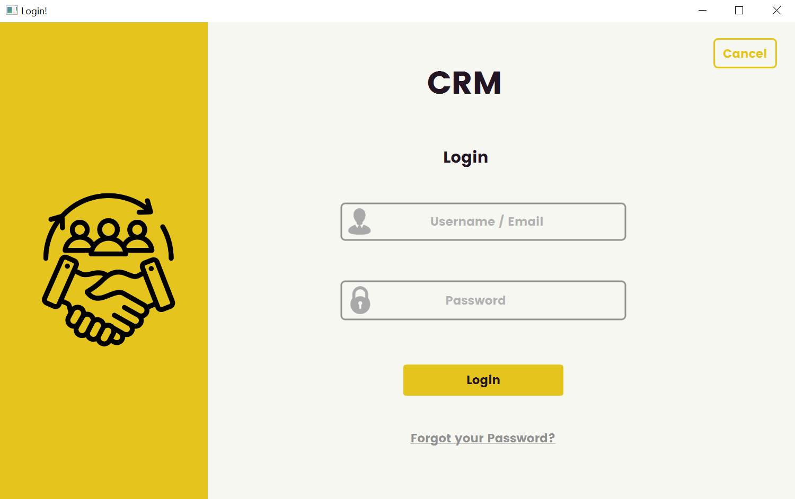
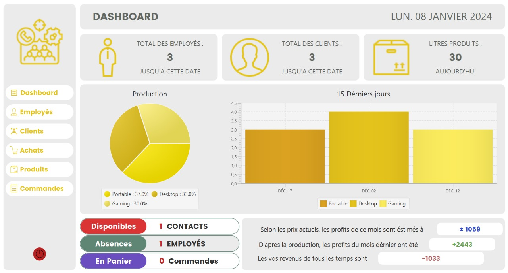

# CRM

#### CRM, ou Gestion de la Relation Client en français, désigne un ensemble de pratiques, de technologies et de stratégies visant à gérer et à améliorer les interactions d'une entreprise avec ses clients.

#### Le logiciel CRM, est un programme écrit en Java qui facilite la collecte, l'organisation et l'analyse des données clients. Il pourrait inclure des fonctionnalités telles que la gestion des contacts

#### ----------------------------------------
### Réalisé par :
#### +  Lagraini Zakaria
#### +  Souita Ikram
#### +  Jord Reda
#### ----------------------------------------

